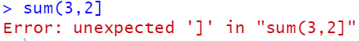
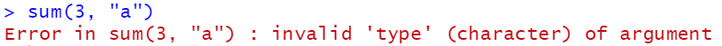
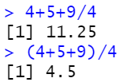
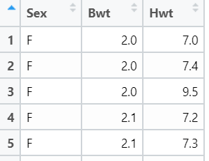
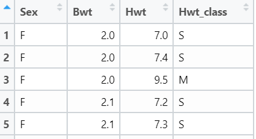
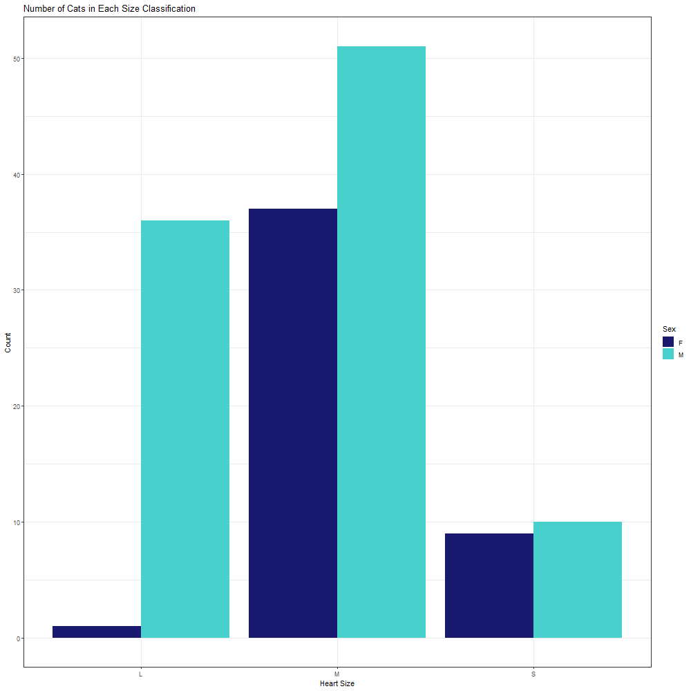
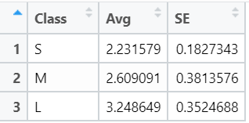
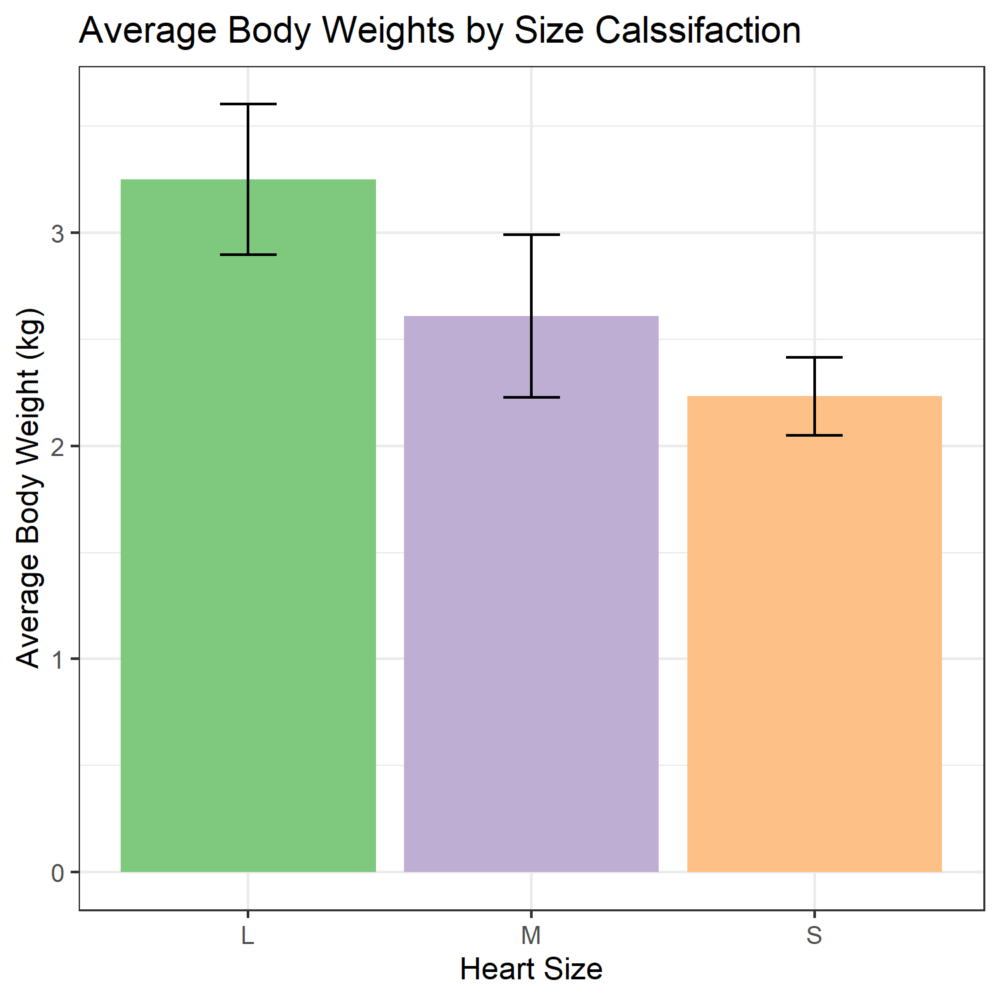

```{r setup, include=FALSE}
knitr::opts_chunk$set(echo = TRUE)
```

```{r, include=FALSE, eval=FALSE}
library(MASS)

if (!require("ggplot2")) {
  install.packages("ggplot2") #could not find function
}
library(ggplot2)

cat_data_sol <- cats #or
cat_data_sol <- read.csv("cats.csv", header=T, row.names=1)

cat_data_sol$Sex[144]
cat_data_sol$Bwt[-c(1:143)] #negative indexing
cat_data_sol[144, 2:3]

large_hearts <- cat_data_sol[cat_data_sol$Hwt > 12, ] #or
large_hearts <- subset(cat_data_sol, Hwt > 12)

small_hearts <- subset(cat_data_sol, Hwt < 8)

hwt_class <- rep("M", 144)
large_ids <- which(cat_data_sol$Hwt > 12)
hwt_class[large_ids] <- "L"
small_ids <- which(cat_data_sol$Hwt < 8)
hwt_class[small_ids] <- "S"
cat_data_sol$Hwt_class <- hwt_class

write.csv(cat_data_sol, "./cats_edited.csv")

png("frequency_plot.png", width=1000, height=1000)
freq <- ggplot(data=cat_data_sol, aes(x=Hwt_class, fill=Sex))+
  geom_bar(stat="count", position=position_dodge())+
  xlab("Heart Size")+ ylab("Count")+
  ggtitle("Number of Cats in Each Size Classification")+
  scale_fill_manual(values=c("midnightblue", "mediumturquoise"))+
  theme_bw()
print(freq)
dev.off()

avg <- c(mean(cat_data_sol[cat_data_sol$Hwt_class == "S",2]),
         mean(cat_data_sol[cat_data_sol$Hwt_class == "M",2]),
         mean(cat_data_sol[cat_data_sol$Hwt_class == "L",2]))
se <- c(sd(cat_data_sol[cat_data_sol$Hwt_class == "S",2]),
        sd(cat_data_sol[cat_data_sol$Hwt_class == "M",2]),
        sd(cat_data_sol[cat_data_sol$Hwt_class == "L",2]))
Hwt <- data.frame(Class=c("S", "M", "L"),
                      Avg=avg, SE=se)

ggplot(data=Hwt, aes(x=Class, y=Avg, fill=Class))+
  geom_bar(stat="identity")+
  geom_errorbar(aes(ymin=Avg-SE, ymax=Avg+SE), 
                width=.2)+
  guides(fill=F)+
  xlab("Heart Size")+ ylab("Average Body Weight (kg)")+
  ggtitle("Average Body Weights by Size Calssifaction")+
  scale_fill_brewer(palette="Accent")+
  theme_bw()
ggsave("avg_plot.png", width=5, height=5)
```

```{r, include=FALSE}
library(MASS)
if (!require("ggplot2")) {
  install.packages("ggplot2") #could not find function
}
library(ggplot2)
```

#### Please reach out on the STEM-Away forums with any questions.

These modules will hopefully help you get a handle on debugging code. They are intended as an introduction to debugging to help you get a sense for the process. If you like, you can download the accompanying R script, <a href="./DebuggingPractice.R">here</a>, and try debugging it without the modules. 

The process of debugging is a huge component of programming and it's important you know how to deal with errors in your code. However, not all errors will return error messages telling you what's wrong. Let me introduce the three types of errors you should be aware of:

1. **Syntax errors**: These errors are like "spelling and grammar" errors in English. They concern the *syntax* of the programming language you're using. For instance, forgetting to close a parenthesis when using a function:



These are the easiest to handle since they output error messages telling you what's wrong, and most times, **where** it's is wrong. 

2. **Semantic errors**: These errors have to do with the meaning and context. They are often caused by type mismatches. For example, the `sum()` function expects numeric input. If a character or string is given, the function will return an error.



3. **Logical errors**: These errors have to do with the program flow. A classic example is found in learning PEMDAS, the order of operations in math equations. 



These errors are often the hardest to identify and debug because they typically do not return an error message. Logical errors are identified when a program or function has an unintended output.

# Debugging Tips
- Check spellings.
- Ensure that your variables contain the information you expect.
- Check that all brackets are closed.
- Ensure that all data and libraries are loaded correctly.
- If you keep trying and trying and nothing seems to work, try clearing your environment (there's a little broom icon at the top of the Environment tab) and running your working code again.

# Debugging Modules

### Module 1 (Lines 17-18)

<pre>
cat_data <- cats #or
cat_data <- read.csv("cat.csv", header=F, row.names=NULL)
</pre>

The cat_data data frame should look something like this:



#### Hints - click on the code buttons to the right to show hints.
```{r, eval=FALSE}
# What is the name of the csv you are trying to access? Check your directory.
```
```{r, eval=FALSE}
# What does `header=F` do? Check the documentation for `read.csv()`.
```
```{r, eval=FALSE}
# What does `row.names=NULL` do? Check the documentation for `read.csv()`.
```

#### Solution - click on the code button to the right to show a solution
```{r, eval=FALSE}
cat_data <- cats #or
cat_data <- read.csv("cats.csv", header=T, row.names=1)
```

### Module 2 (Lines 21-23)

<pre>
cat_data$Sex[144,]
cat_data$Bwt[c(1:143)] #negative indexing
cat_data[144, 2:3]
</pre>

The expected output should look something like this:

[1] "M" <br>

[1] 3.9 <br>

  Bwt   Hwt <br>
144   3.9   20.5

#### Hints - click on the code buttons to the right to show hints.
```{r, eval=FALSE}
# How do you index a vector?
```
```{r, eval=FALSE}
# How do you do negative indexing?
```

#### Solution - click on the code button to the right to show a solution.
```{r, eval=FALSE}
cat_data$Sex[144]
cat_data$Bwt[-c(1:143)] #negative indexing
cat_data[144, 2:3]
```

### Module 3 (Lines 27-30)

<pre>
large_hearts <- cat_data[cat_data$Hwt > 12] #or
large_hearts <- subset(cat_data, Hwt > 12)

small_hearts <- subset(cat_data, Hwt < 8)
</pre>

#### Hint - click on the code button to the right to show a hint.
```{r, eval=FALSE}
# How do you index a data frame?
```

#### Solution - click on the code button to the right to show a solution.
```{r, eval=FALSE}
large_hearts <- cat_data[cat_data$Hwt > 12, ] #or
large_hearts <- subset(cat_data, Hwt > 12)

small_hearts <- subset(cat_data, Hwt < 8)
```

### Module 4 (Lines 33-38)

<pre>
hwt_class <- rep("M", 154)
large_ids <- which(cat_data$Hwt > 12)
hwt_class[large_ids] <- "L"
small_ids <- whihc(cat_data$Hwt < 8)
hwt_class[small_ids] <- "S"
cat_data$Hwt_class <- hwt_class
</pre>

The cat_data data frame should now look something like this:



#### Hints - click on the code buttons to the right to show hints.
```{r, eval=FALSE}
# What is the length of `hwt_class`? What is the length of a column in `cat_data`. Remember that data frames are a collection of vectors of the same length.
```
```{r, eval=FALSE}
# Check spelling.
```

#### Solution - click on the code button to the right to show a solution
```{r, eval=FALSE}
hwt_class <- rep("M", 144)
large_ids <- which(cat_data$Hwt > 12)
hwt_class[large_ids] <- "L"
small_ids <- which(cat_data$Hwt < 8)
hwt_class[small_ids] <- "S"
cat_data$Hwt_class <- hwt_class
```

### Module 5 (Line 41)

<pre>
write.csv(cats_data, "./cats_edited.csv")
</pre>

#### Hint - click on the code button to the right to show a hint.
```{r, eval=FALSE}
# Check spelling.
```

#### Solution - click on the code button to the right to show a solution.
```{r, eval=FALSE}
write.csv(cat_data, "./cats_edited.csv")
```


### Module 6 (Lines 45-52)

<pre>
png("frequency_plot.png", width=1000, height=1000)
freq <- ggplot(data=cat_data, aes(x=Hwt_class, colour=Sex))+
  geom_bar(stat="count", position="stack")+
  xlab("Heart Size")+ ylab("Count")+
  ggtitle("Number of Cats in Each Size Classification")+
  scale_fill_manual(values=c("midnightblue", "mediumturquoise"))+
  theme_bw()
dev.off()
</pre>

The code above should produce a plot that looks like this:



#### Hints - click on the code buttons to the right to show hints.
```{r, eval=FALSE}
# Do the aesthetics in the `ggplot()` function correspond to those in the `scale_*fill*_brewer()` function?
```
```{r, eval=FALSE}
# Are there alternative settings for position in the geom_bar() function?
```
```{r, eval=FALSE}
# If you store a plot as an object, there's one more step you need to do for writing it to a file. If you're stuck, check out the Graphs section of Cookbook for R.
```

#### Solution - click on the button to the right to show a solution.
```{r, eval=FALSE}
png("frequency_plot.png", width=1000, height=1000)
freq <- ggplot(data=cat_data, aes(x=Hwt_class, fill=Sex))+
  geom_bar(stat="count", position=position_dodge())+
  xlab("Heart Size")+ ylab("Count")+
  ggtitle("Number of Cats in Each Size Classification")+
  scale_fill_manual(values=c("midnightblue", "mediumturquoise"))+
  theme_bw()
print(freq)
dev.off()
```

### Module 7 (Lines 55-61)

<pre>
avg <- c(mean(cat_data[cat_data$Hwt_class == "S",2]),
         mean(cat_data[cat_data$Hwt_class == "M",2]))
se <- c(sd(cat_data[cat_data$Hwt_class == "S",]),
        sd(cat_data[cat_data$Hwt_class == "M",]),
        sd(cat_data[cat_data$Hwt_class == "L",]))
Hwt <- data.frame(Class=c("S", "M", "L"),
                      Avg=avg, SE=SE)
</pre>

The Hwt data frame should look something like this:



#### Hints - click on the code buttons to the right to show hints.
```{r, eval=FALSE}
# What kind of object is returned by `cat_data[cat_data$Hwt_class == "S",]`? 
```
```{r, eval=FALSE}
# What kind of argument does `sd()` expect?
```
```{r, eval=FALSE}
# How many elements are in `avg`? How many elements are in `se`? Remember that data frames are a collection of vectors of the same length.
```
```{r, eval=FALSE}
# R is case sensitive. Are there any instances where the code is trying to refer to an object but mismatches the case?
```

#### Solution - click on the code button to the right to show a solution
```{r, eval=FALSE}
avg <- c(mean(cat_data[cat_data$Hwt_class == "S",2]),
         mean(cat_data[cat_data$Hwt_class == "M",2]),
         mean(cat_data[cat_data$Hwt_class == "L",2]))
se <- c(sd(cat_data[cat_data$Hwt_class == "S",2]),
        sd(cat_data[cat_data$Hwt_class == "M",2]),
        sd(cat_data[cat_data$Hwt_class == "L",2]))
Hwt <- data.frame(Class=c("S", "M", "L"),
                      Avg=avg, SE=se)
```

### Module 8 (Lines 63-72)

<pre>
ggplot(data=Hwt, aes(x=Class, y=Avg, fill=Class))+
  geom_bar(stat="count")+
  geom_errorbar(aes(ymin=Avg-SE, ymax=Avg+SE), 
                width=1)+
  guides(fill=F)
  xlab("Heart Size")+ ylab("Average Body Weight (kg)")+
  ggtitle("Average Body Weights by Size Calssifaction")+
  scale_fill_brewer("Accent")+
  theme_bw()
ggsave("avg_plot.png", width=5, height=5)
</pre>

The code above should produce a plot that looks like this:



#### Hints - click on the code buttons to the right to show hints.
```{r, eval=FALSE}
# Are there alternative settings for stat in the `geom_bar()` function?
```
```{r, eval=FALSE}
# What does width in the `geom_errorbar()` function do?
```
```{r, eval=FALSE}
# Where are the modified labels and title? Pay attention to what follows the `guides()` function.
```
```{r, eval=FALSE}
# Look at the documentation for `scale_fill_brewer()`. What is `"Accent"` referring to?
```

#### Solution - click on the code button to the right to show a solution.

```{r eval=FALSE}
ggplot(data=Hwt, aes(x=Class, y=Avg, fill=Class))+
  geom_bar(stat="identity")+
  geom_errorbar(aes(ymin=Avg-SE, ymax=Avg+SE), 
                width=.2)+
  guides(fill=F)+
  xlab("Heart Size")+ ylab("Average Body Weight (kg)")+
  ggtitle("Average Body Weights by Size Calssifaction")+
  scale_fill_brewer(palette="Accent")+
  theme_bw()
ggsave("avg_plot.png", width=5, height=5)
```

<br>
<br>
<br>
<br>
<br>
<br>
<br>
<br>
<br>
<br>